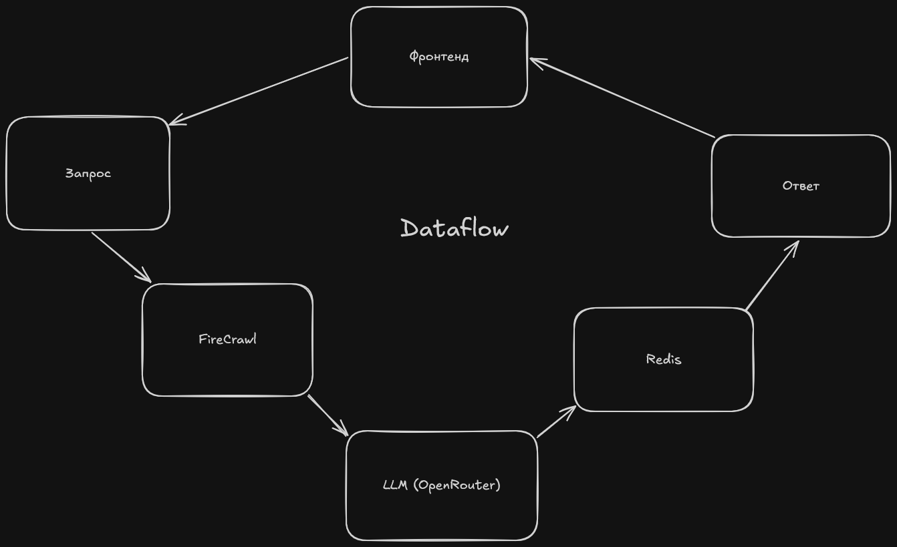

# Скрейпер поставщиков для food-индустрии
Сервис для быстрого поиска и сравнения поставщиков индгредиентов, продукции и упаковки.
Пользователь ищет объект поиска и регион, устанавливает лимит страниц для поисковика -
получает таблицу поставщиков с контактами, минимальной ценой/объемом заказа и сертификатами.

### Архитектура


- После нажатия "Найти" запрос пользователя поступает на бэкенд и передается в 
`firecrawl` - сервис для парсинга, созданный специально для нужд *ИИ и нейросетей*
- Полученные данные обрабатывается LLM через API `OpenRouter` - извлекается вся полезная информация
- Данные сохраняются в `SortedSet` в `Redis` (оптимизировано для работы с ранжированными списками)
для легкого визуального сравнения (см. [эвристика](#эвристика-сравнения))
- Пользователь видит данные в виде таблицы и при желании может экспортировать их в 
формат `.csv` (например, для дальнейшей работы в `Excel`)

### Стек
- `FastAPI`
- `Firecrawl`
- `OpenRouter`
- `Redis`
- `Pydantic`
- `langchain`

### Эвристика сравнения
Для определения наиболее подходящего поставщика система использует
`взвешенную сумму` характеристик извлеченной информации (наличие сертификатов, 
информация о минимальном объеме заказа, контактная информация)
$$
score_i = \sum_i^N{w_i * property_i}
$$
Это значение используется для ранжирования записей в ответе сервиса

### Запуск
```bash
cd backend
python -m fastapi dev main.py
cd ../frontend
npm run dev -- --open
```
*Примечание: для запуска в терминале Windows (НЕ CMD) можно использовать `start.bat` в корне проекта*


